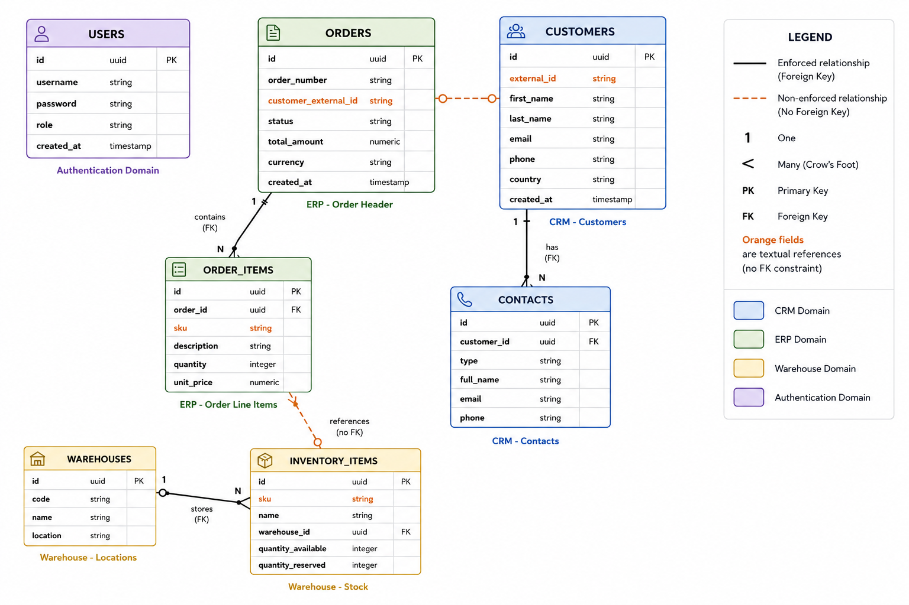

# Overview of the Orchestra Platform Database

The schema represents the data architecture of the **Orchestra platform**, a fictional industrial company that sells hardware components such as sensors, power supplies, and control units to business customers across Europe.

The database is intentionally designed to simulate a **fragmented enterprise environment**, where multiple systems evolved independently and communicate only through weak textual references instead of strong relational links.

The platform is divided into three major business domains:

1. **CRM System** → Customer Relationship Management; manages customers and contacts  
2. **ERP System** → Enterprise Resource Planning; manages sales orders and ordered products  
3. **Warehouse System** → manages stock and physical inventory  

A fourth small domain handles platform authentication (`USERS`).



---

# High-Level Architecture

The schema contains **7 tables**:

| Area | Tables |
|---|---|
| CRM | `CUSTOMERS`, `CONTACTS` |
| ERP | `ORDERS`, `ORDER_ITEMS` |
| Warehouse | `WAREHOUSES`, `INVENTORY_ITEMS` |
| Authentication | `USERS` |

The most important architectural characteristic is that:

- some relationships are implemented using proper **foreign keys**
- other relationships are intentionally implemented only through **plain string fields**

This creates a hybrid system where:
- some data integrity is enforced by the database
- some integrity depends entirely on application logic

This mirrors many real-world legacy enterprise systems.

---

# Core Business Flow

The overall business process represented by the schema is:

1. A company customer exists in the CRM
2. The customer places an order through the ERP
3. The order contains one or more products
4. Products correspond to SKUs (Stock Keeping Unit) tracked by the warehouse system
5. Inventory is stored inside physical warehouses
6. Contacts are attached to customers for communication purposes

---

# Table-by-Table Description

---

# 1. USERS

This table stores platform login accounts.

It is completely isolated from the business data and does not directly relate to customers, orders, or inventory.

## Purpose

Used for:
- authentication
- authorization
- platform administration

## Columns

| Column | Type | Description |
|---|---|---|
| `id` | uuid | Primary key |
| `username` | string | Login username |
| `password` | string | Password hash or credential |
| `role` | string | User role (admin, operator, manager, etc.) |
| `created_at` | timestamp | Account creation timestamp |

## Notes

- No foreign keys
- No relationship to customers or employees
- Purely application-level security table

---

# 2. CUSTOMERS

This is the main CRM table.

It stores company clients that buy products from Orchestra.

## Purpose

Represents:
- organizations
- client companies
- business customers

## Columns

| Column | Type | Description |
|---|---|---|
| `id` | uuid | Primary key |
| `external_id` | string | CRM identifier (e.g. `CRM-001`) |
| `first_name` | string | Main customer first name |
| `last_name` | string | Main customer last name |
| `email` | string | Customer email |
| `phone` | string | Customer phone |
| `country` | string | Customer country |
| `created_at` | timestamp | Creation date |

## Important Design Detail

The `external_id` field is critical.

It acts as the public CRM identifier used by external systems.

Example:

```text
CRM-001
CRM-002
CRM-003
```

The ERP system references customers using this string instead of a real foreign key.

This is one of the intentional architectural weaknesses.

---

# 3. CONTACTS

This table stores additional contact persons related to a customer.

## Purpose

Allows one customer company to have:
- billing contacts
- support contacts
- purchasing contacts
- technical contacts

## Columns

| Column | Type | Description |
|---|---|---|
| `id` | uuid | Primary key |
| `customer_id` | uuid | FK to `CUSTOMERS.id` |
| `type` | string | Contact type |
| `full_name` | string | Contact name |
| `email` | string | Contact email |
| `phone` | string | Contact phone |

---

## Relationship: CUSTOMERS → CONTACTS

```text
CUSTOMERS (1) ────────< CONTACTS (many)
```

Meaning:
- one customer can have multiple contacts
- every contact belongs to exactly one customer

This relationship is enforced correctly using a foreign key.

### Foreign Key

```sql
CONTACTS.customer_id
    REFERENCES CUSTOMERS(id)
```

---

# 4. ORDERS

This is the central ERP table.

It stores commercial sales orders.

## Purpose

Represents:
- purchase transactions
- customer purchases
- order headers

Each row corresponds to one order.

## Columns

| Column | Type | Description |
|---|---|---|
| `id` | uuid | Primary key |
| `order_number` | string | Human-readable order code |
| `customer_external_id` | string | CRM customer reference |
| `status` | string | Order status |
| `total_amount` | numeric | Total order value |
| `currency` | string | Currency code |
| `created_at` | timestamp | Order creation timestamp |

---

## Important Architectural Problem

The field:

```text
customer_external_id
```

references:

```text
CUSTOMERS.external_id
```

BUT:
- it is NOT a foreign key
- the database does NOT enforce integrity

Therefore:
- orders may reference missing customers
- customers may be deleted without affecting orders
- typos may create orphaned references

This simulates real ERP/CRM integration problems.

---

## Relationship: ORDERS → CUSTOMERS

Logical relationship:

```text
ORDERS.customer_external_id
        ↔
CUSTOMERS.external_id
```

But:
- this is only a textual association
- not a relational constraint

So the diagram correctly labels it:

```text
customer_external_id (no FK)
```

---

# 5. ORDER_ITEMS

This table stores the individual products inside an order.

## Purpose

Represents:
- line items
- purchased products
- quantities and prices

Each row corresponds to one product inside one order.

---

## Columns

| Column | Type | Description |
|---|---|---|
| `id` | uuid | Primary key |
| `order_id` | uuid | FK to `ORDERS.id` |
| `sku` | string | Product SKU |
| `description` | string | Product description |
| `quantity` | integer | Ordered quantity |
| `unit_price` | numeric | Price per unit |

---

# Relationship: ORDERS → ORDER_ITEMS

```text
ORDERS (1) ────────< ORDER_ITEMS (many)
```

Meaning:
- one order contains multiple items
- each item belongs to exactly one order

This relationship is enforced properly.

### Foreign Key

```sql
ORDER_ITEMS.order_id
    REFERENCES ORDERS(id)
```

---

# Important Architectural Problem

The `sku` field references products only by text.

It corresponds logically to:

```text
INVENTORY_ITEMS.sku
```

But:
- there is NO foreign key
- the database does NOT guarantee the SKU exists

This means:
- orders can contain invalid products
- products can disappear from inventory
- mismatches can occur silently

Again, this simulates real integration problems.

---

# Relationship: ORDER_ITEMS → INVENTORY_ITEMS

Logical relationship:

```text
ORDER_ITEMS.sku
      ↔
INVENTORY_ITEMS.sku
```

But:
- no FK exists
- relationship is informational only

---

# 6. WAREHOUSES

This table represents physical storage locations.

## Purpose

Represents:
- warehouse buildings
- storage facilities
- distribution centers

---

## Columns

| Column | Type | Description |
|---|---|---|
| `id` | uuid | Primary key |
| `code` | string | Warehouse code |
| `name` | string | Warehouse name |
| `location` | string | Geographic location |

---

# 7. INVENTORY_ITEMS

This table stores stock availability.

## Purpose

Tracks:
- products
- stock levels
- reserved quantities
- warehouse placement

---

## Columns

| Column | Type | Description |
|---|---|---|
| `id` | uuid | Primary key |
| `sku` | string | Product SKU |
| `name` | string | Product name |
| `warehouse_id` | uuid | FK to warehouse |
| `quantity_available` | integer | Available stock |
| `quantity_reserved` | integer | Reserved stock |

---

# Relationship: WAREHOUSES → INVENTORY_ITEMS

```text
WAREHOUSES (1) ────────< INVENTORY_ITEMS (many)
```

Meaning:
- one warehouse stores many inventory items
- each inventory item belongs to one warehouse

This relationship is correctly enforced.

### Foreign Key

```sql
INVENTORY_ITEMS.warehouse_id
    REFERENCES WAREHOUSES(id)
```

---

# Relationship Summary

# Proper Foreign-Key Relationships

These relationships are enforced by the database:

```text
CUSTOMERS.id
    → CONTACTS.customer_id

ORDERS.id
    → ORDER_ITEMS.order_id

WAREHOUSES.id
    → INVENTORY_ITEMS.warehouse_id
```

These ensure referential integrity.

---

# Weak / Non-Enforced Relationships

These relationships exist only conceptually:

```text
ORDERS.customer_external_id
    ↔ CUSTOMERS.external_id

ORDER_ITEMS.sku
    ↔ INVENTORY_ITEMS.sku
```

These are NOT protected by the database.

This is the central theme of the schema.

---

# Why the Design Matters

The schema demonstrates common enterprise integration issues:

## Advantages

- systems can evolve independently
- easier integration with legacy software
- flexible external identifiers

## Problems

- missing referential integrity
- orphaned records
- inconsistent data
- synchronization errors
- difficult reporting
- complex validation logic

---

# Example Data Anomalies

The description mentions two intentional anomalies.

## 1. Missing Customer

An order may contain:

```text
customer_external_id = CRM-999
```

but no such customer exists.

The database allows this because no FK exists.

---

## 2. Invalid SKU

An order item may contain:

```text
sku = SKU-404
```

but no inventory item exists with that SKU.

Again, the database allows it.

---

# Visual Interpretation of the Diagram

The diagram uses two different relationship styles.

## Solid FK Relationships

These indicate actual relational integrity.

Examples:
- `CUSTOMERS → CONTACTS`
- `ORDERS → ORDER_ITEMS`
- `WAREHOUSES → INVENTORY_ITEMS`

These are safe, enforced links.

---

## Weak Textual Relationships

Marked with:

```text
(no FK)
```

Examples:
- `customer_external_id`
- `sku`

These represent:
- loose coupling
- integration through identifiers
- non-enforced references

These are the intentionally problematic parts of the architecture.

---

# Overall Interpretation

This schema is essentially a teaching example of:

- distributed enterprise systems
- legacy integration
- weak coupling
- referential integrity problems
- CRM/ERP/Warehouse synchronization

It models a realistic mid-sized industrial company where:
- departments adopted software independently
- integration happened later
- identifiers became shared informally
- the database cannot fully guarantee consistency

The architecture is therefore both:
- functional from a business perspective
- intentionally fragile from a data integrity perspective