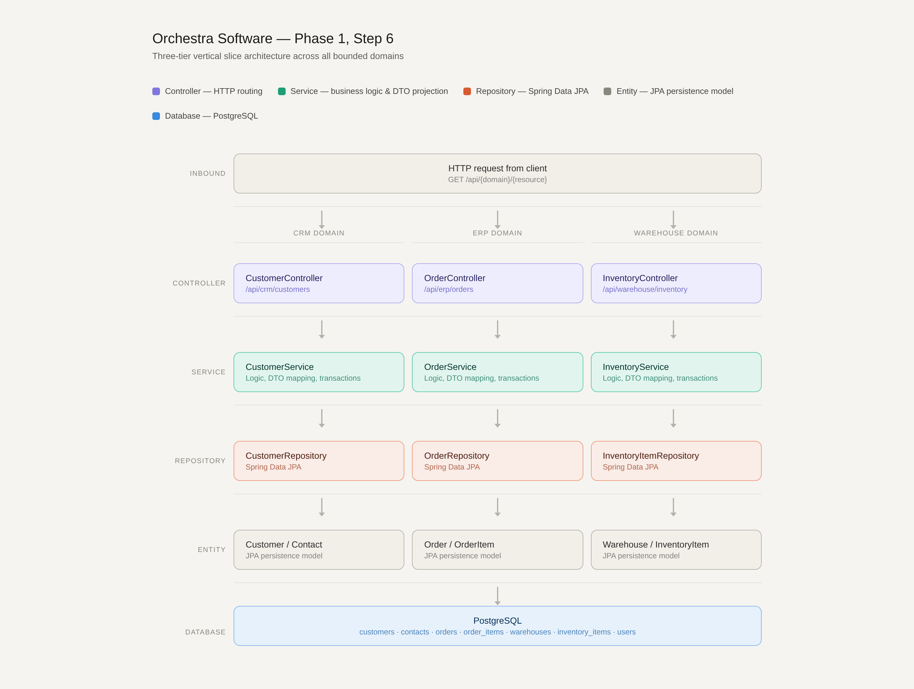

# Vertical Slice Architecture and Layered Domain Structure

The Orchestra platform implements a vertical slice architecture across all three bounded domains — CRM, ERP, and Warehouse — by building the complete request-handling pipeline from HTTP ingress down to the persistence layer. Each domain follows a strict three-tier structure that enforces separation of concerns and preserves clean boundaries between infrastructure, business logic, and API contracts.


---

# Repository Layer

The repository layer extends `JpaRepository`, delegating all persistence responsibilities to Spring Data JPA.

Method signatures such as:

```java
findByExternalId(...)
findByCustomerExternalId(...)
```

leverage Spring's query derivation mechanism, allowing Spring to generate type-safe JPQL queries automatically at application startup rather than constructing them dynamically at runtime.

For more complex retrieval operations, custom `@Query` annotations are used. This is especially important for the `JOIN FETCH` queries that eagerly load associations in a single SQL statement.

Without these explicit fetch strategies, the application would suffer from the **N+1 select problem**, where serializing entity graphs into JSON would trigger additional database queries for every nested association.

Example:

```java
@Query("""
    SELECT o
    FROM Order o
    JOIN FETCH o.items
    WHERE o.id = :id
""")
Optional<Order> findWithItems(UUID id);
```

This approach improves:
- performance
- query predictability
- serialization efficiency

---

# Service Layer

The service layer acts as:
- the domain transaction boundary
- the exclusive owner of business logic

Annotating the service with:

```java
@Transactional(readOnly = true)
```

propagates a read-only transactional context to all repository calls by default.

This gives:
- the connection pool
- Hibernate
- the database optimizer

a meaningful performance hint indicating that no write operations will occur.

The service layer is also responsible for **DTO projection**, transforming internal JPA entities into external API contracts.

For example:

```java
quantityFree = quantityAvailable - quantityReserved
```

in `InventoryItemDto` is a computed concern that belongs to the API representation rather than the persistence schema itself.

This separation prevents the database model from becoming polluted with presentation-oriented concerns.

---

# Controller Layer

The controller layer is intentionally minimal.

Its responsibilities are limited to:
- defining route mappings
- receiving HTTP requests
- delegating immediately to the service layer
- wrapping responses inside `ResponseEntity`

No business logic is implemented inside controllers.

This is a deliberate architectural constraint because any rule implemented inside a controller:
- becomes difficult to unit test
- depends on the full HTTP stack
- cannot be easily reused by:
  - scheduled jobs
  - event consumers
  - background workers
  - other services

Example:

```java
@GetMapping("/{id}")
public ResponseEntity<OrderDto> getOrder(@PathVariable UUID id) {
    return ResponseEntity.ok(orderService.findById(id));
}
```

The controller remains purely infrastructural.

---

# DTO Layer

The DTO layer defines the public API contract using immutable Java records.

Example:

```java
public record CustomerDto(
    String externalId,
    String firstName,
    String lastName
) {}
```

Decoupling the wire format from JPA entities allows:
- the API contract to evolve independently
- database schema migrations without breaking clients
- API versioning without modifying persistence logic

This protects external consumers from internal structural changes.

---

# Domain Isolation and Weak Coupling

The intentional absence of foreign keys between domains is already visible at the application layer.

Examples include:

```text
customer_external_id
```

stored as a plain `VARCHAR` in `orders`, and:

```text
sku
```

stored as a plain `VARCHAR` in `order_items`.

Because these are not enforced relational links:
- repositories cannot perform direct cross-domain joins
- domain services remain isolated
- each bounded context owns only its own data

As a consequence:

- `OrderService` cannot directly resolve customer details from CRM
- `InventoryService` cannot automatically validate ERP order SKUs
- repositories remain domain-local

Resolving those cross-domain relationships requires orchestration outside the individual domains.

This architectural limitation is intentional and sets the foundation for the orchestration layer introduced later in the system design.